# OpenHabitTracker

https://openhabittracker.net

## App:

https://pwa.openhabittracker.net

Take Markdown notes, plan tasks, track habits

- Free and Ad-Free
- Open Source
- Privacy Focused: All user data is stored locally on your device
- Available on Windows, Linux, Android, iOS, macOS, and as a web app
- Localized to English, German, Spanish, Slovenian

Key Features:

- Markdown support for notes
- Use categories and priorities to organize your notes, tasks, and habits
- Advanced Search, Filter, and Sort
- Data Export/Import: JSON, YAML, TSV, Markdown
- Import your notes from Google Keep
- Available in 26 themes with Dark and Light modes

## Stores:

Windows:  

Linux - Flathub:  

Linux - Snap Store:  

Android:  

iOS:  

macOS:  

Android - APKPure:  

## Made with:

*   [Blazor](https://dotnet.microsoft.com/en-us/apps/aspnet/web-apps/blazor)
*   [Bootstrap](https://getbootstrap.com)
*   [Bootswatch](https://bootswatch.com)
*   [CsvHelper](https://joshclose.github.io/CsvHelper)
*   [DnetIndexedDb](https://github.com/amuste/DnetIndexedDb)
*   [Markdig](https://github.com/xoofx/markdig)
*   [WebView2](https://developer.microsoft.com/en-us/microsoft-edge/webview2)
*   [YamlDotNet](https://aaubry.net/pages/yamldotnet.html)

## Runs with:

*   [Blazor WASM](https://learn.microsoft.com/en-us/aspnet/core/blazor)
*   [Blazor Server](https://learn.microsoft.com/en-us/aspnet/core/blazor)
*   [MAUI](https://learn.microsoft.com/en-us/dotnet/maui)
*   [Photino.Blazor](https://github.com/tryphotino/photino.Blazor)
*   [WinForms](https://learn.microsoft.com/en-us/dotnet/desktop/winforms)
*   [Wpf](https://learn.microsoft.com/en-us/dotnet/desktop/wpf)

## Desktop screenshots:

[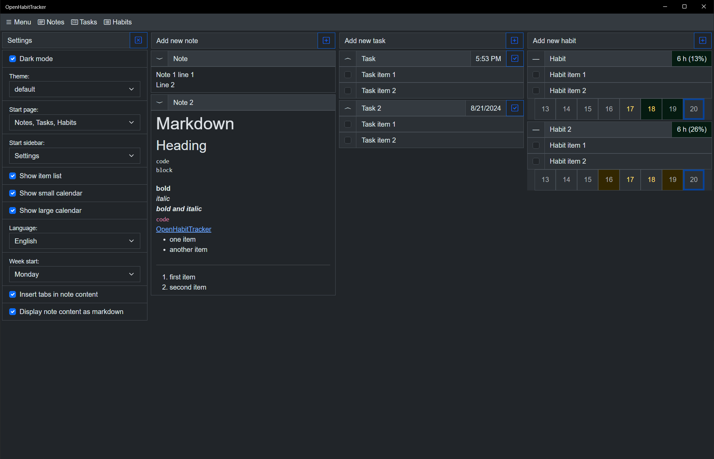](OpenHabitTracker.Web/images/desktop_1_settings.png)
[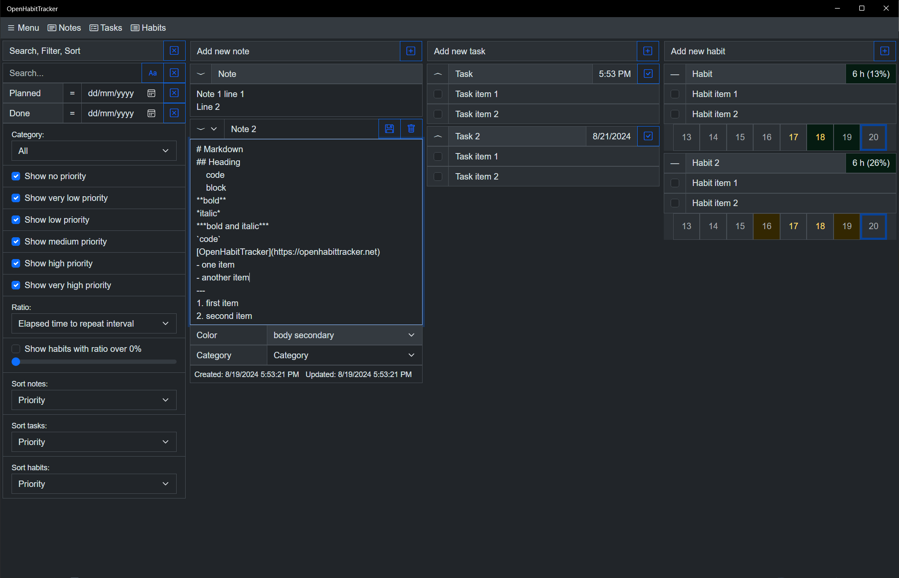](OpenHabitTracker.Web/images/desktop_2_note.png)
[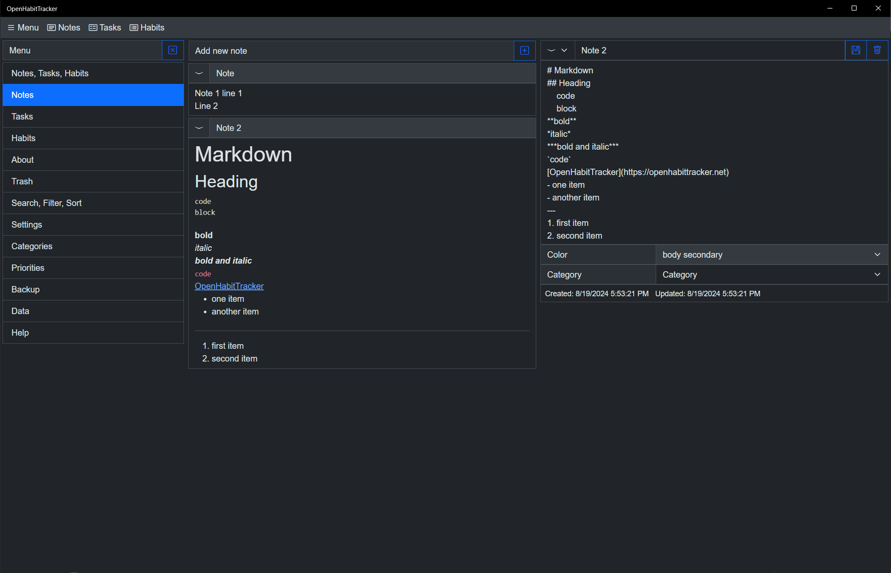](OpenHabitTracker.Web/images/desktop_3_notes.png)
[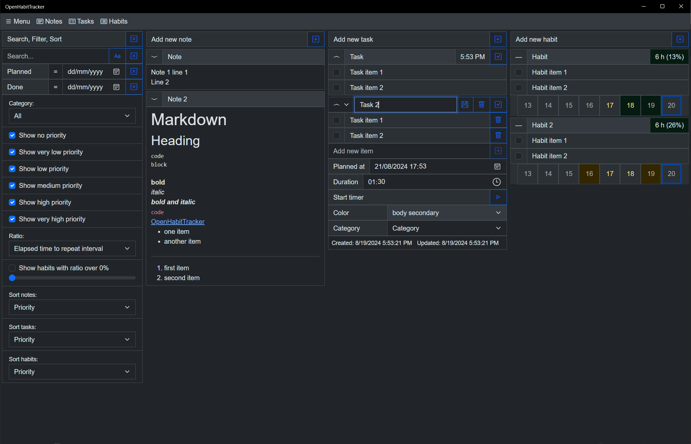](OpenHabitTracker.Web/images/desktop_4_task.png)
[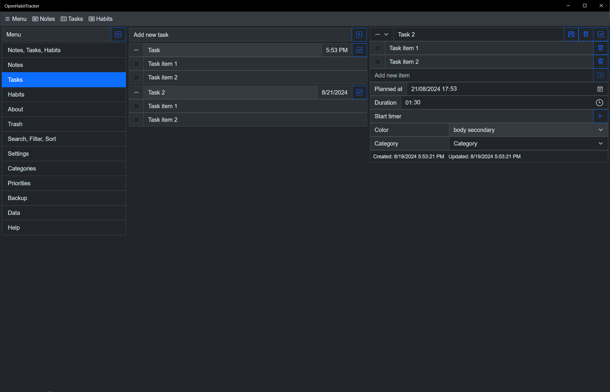](OpenHabitTracker.Web/images/desktop_5_tasks.png)
[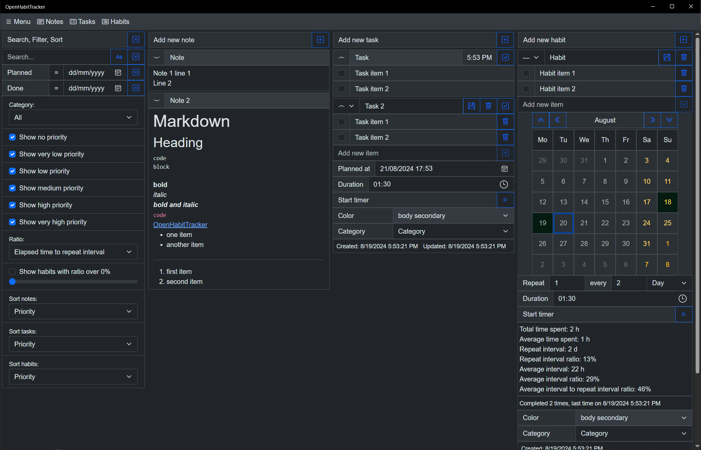](OpenHabitTracker.Web/images/desktop_6_habit.png)
[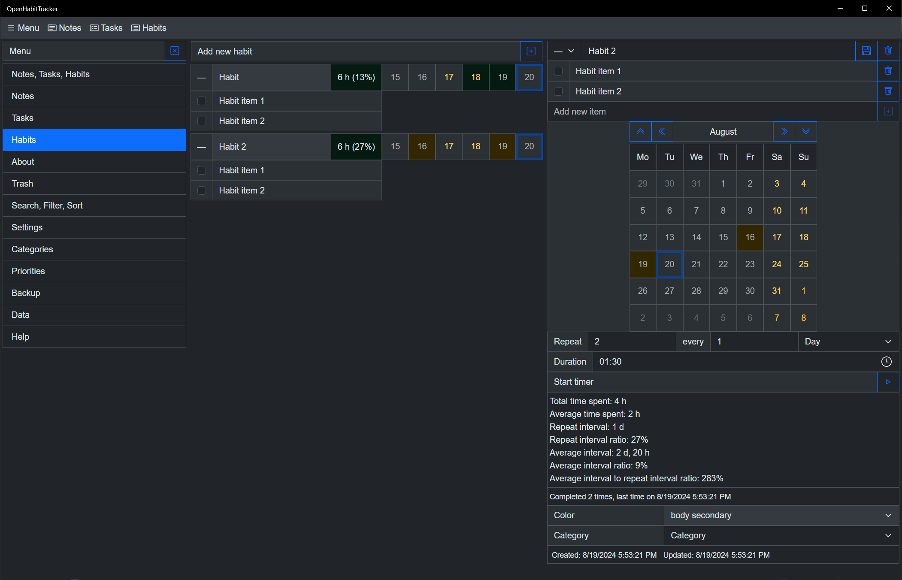](OpenHabitTracker.Web/images/desktop_7_habits.png)
[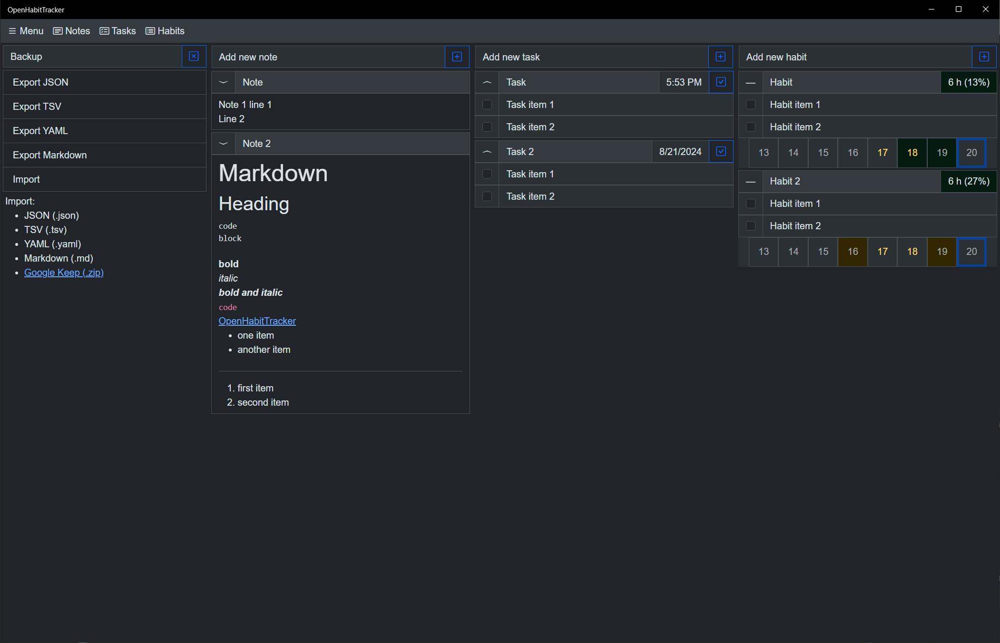](OpenHabitTracker.Web/images/desktop_8_backup.png)

## Phone screenshots:

[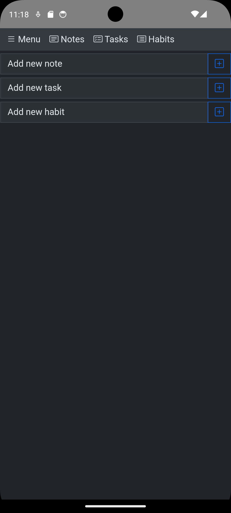](OpenHabitTracker.Web/images/phone_1_empty.png)
[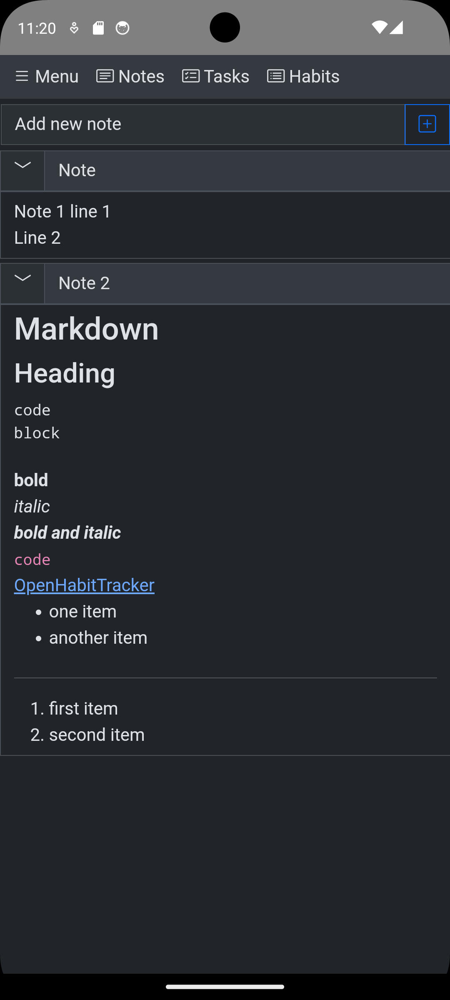](OpenHabitTracker.Web/images/phone_2_notes.png)
[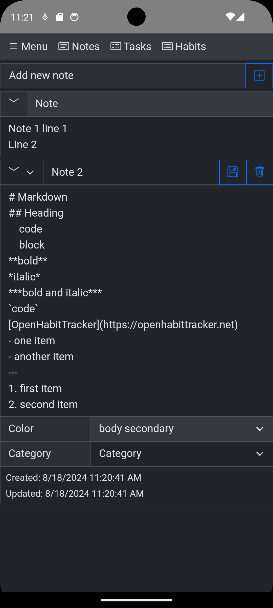](OpenHabitTracker.Web/images/phone_3_markdown.png)
[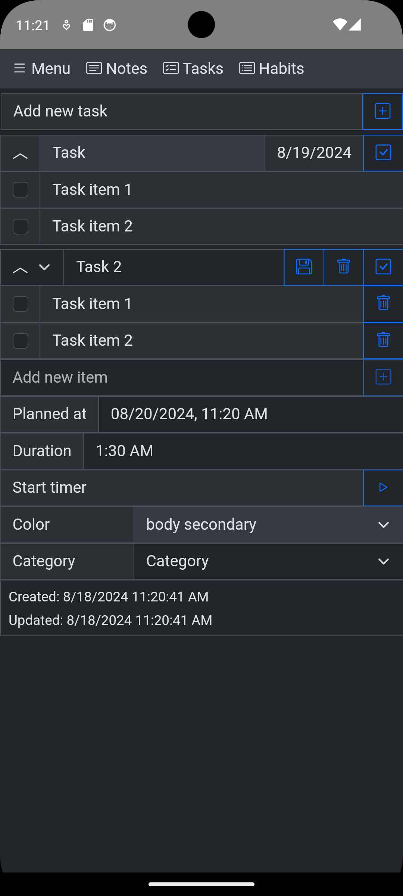](OpenHabitTracker.Web/images/phone_4_task.png)
[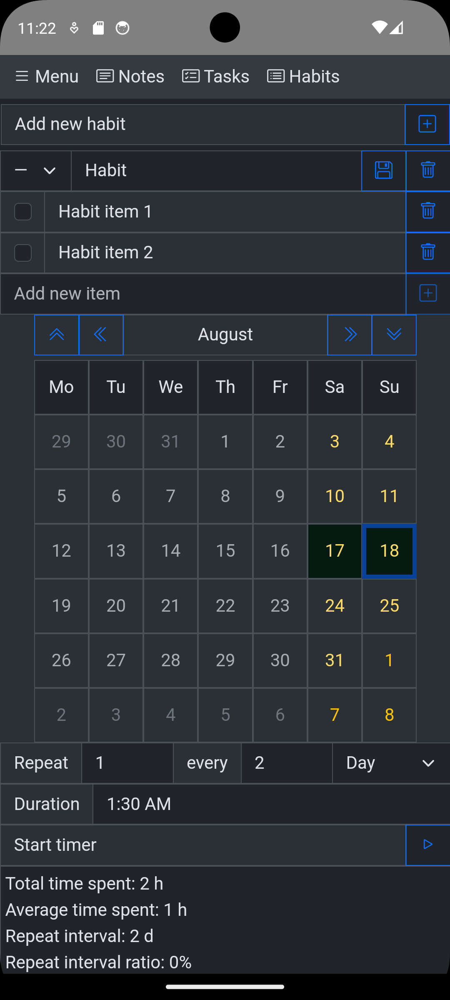](OpenHabitTracker.Web/images/phone_5_habit.png)
[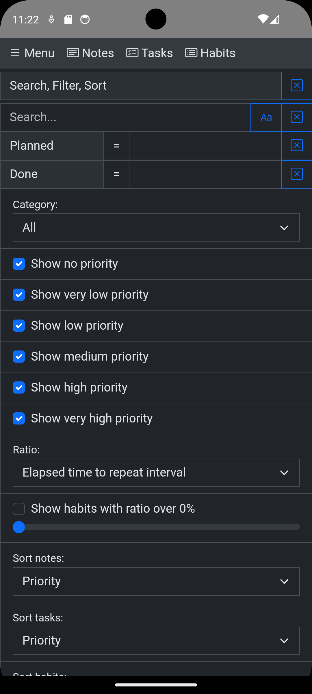](OpenHabitTracker.Web/images/phone_6_search.png)
[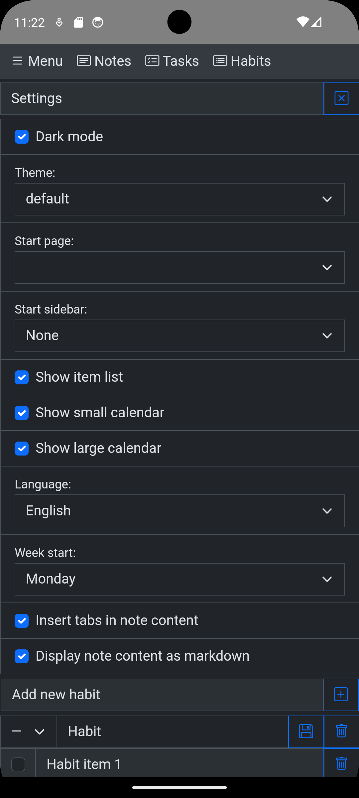](OpenHabitTracker.Web/images/phone_7_settings.png)
[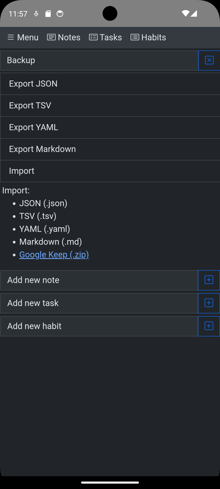](OpenHabitTracker.Web/images/phone_8_backup.png)
