# OpenHabitTracker

https://openhabittracker.net

## App:

https://pwa.openhabittracker.net

Take notes, plan tasks, track habits

OpenHabitTracker is free and open source. The app has no ads, no trackers, no account, no subscriptions and no in-app purchases.

- All your data stays on your device, and syncs only to a server you run yourself
- Available on Windows, Linux, Android, iOS, macOS, as a web app, and self-hosted
- Localized to English, German, Spanish, Slovenian, French, Portuguese, Italian, Japanese, Chinese, Korean, Dutch, Danish, Norwegian, Swedish, Finnish, Polish, Czech, Slovak, Croatian, Serbian

Key features:

- Markdown notes, rendered in the list so reading one costs no clicks
- Tasks with a planned date and time, a duration, a checklist and a timer
- Habits measured by how overdue they are rather than by an unbroken streak: a habit with a 10 day interval that is 2 days overdue reads 120%
- Categories and priorities across notes, tasks and habits
- Import and export JSON, YAML, TSV and Markdown, plus import from a Google Keep Takeout ZIP
- 26 themes with dark and light mode
- Full keyboard navigation and screen reader support

Search, filter and sort:

- Control what the list shows with search, date, category, priority, status and sort
- Planned dates and done dates filtered separately, each before, on, after or not on a date you pick
- Date filters take a fixed date or a number of days from today, worked out when the query runs, so a saved filter never goes stale
- Filter habits by how overdue they are, with a lower bound, an upper bound, or both
- Turn the done-date filter around to see what you have not done in a period
- Eleven sort keys, chosen separately for notes, tasks and habits
- Search reads note text and checklist items, not only titles

Customization:

- Almost everything on screen can be turned on or off: which page and which sidebar open at start, what each row shows, which calendars appear, how the filters are drawn, and how tightly the lists are packed
- Some of them add or remove whole blocks from a habit, so the same habit is either a short form or a full statistics page
- A background color to tell your notes, tasks and habits apart at a glance
- Settings are saved, synced, and included in JSON and YAML backups

## Stores:

Windows:  
[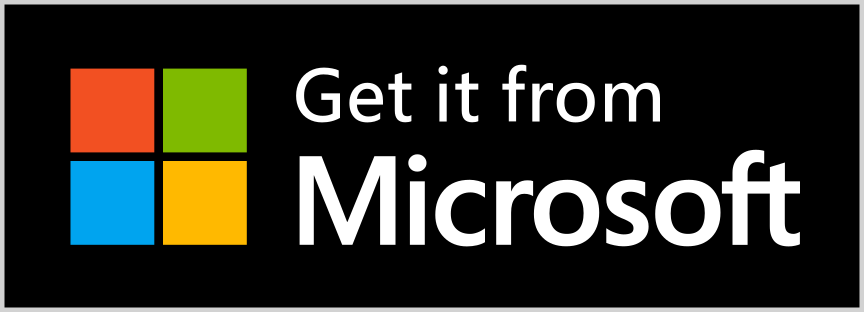](https://apps.microsoft.com/detail/9mwzmlxzzllr)

Linux - Flathub:  
[](https://flathub.org/apps/net.openhabittracker.OpenHabitTracker)

Linux - Snap Store:  
[](https://snapcraft.io/openhabittracker)

Android:  
[](https://play.google.com/store/apps/details?id=net.openhabittracker)

iOS:  
[](https://apps.apple.com/us/app/openhabittracker/id6654885470?platform=iphone)

macOS:  
[](https://apps.apple.com/us/app/openhabittracker/id6654885470?platform=mac)

Android - APKPure:  
[](https://apkpure.com/openhabittracker/net.openhabittracker)

Android - GitHub, auto-updating with [ Obtainium](https://github.com/ImranR98/Obtainium):  
[](https://github.com/Jinjinov/OpenHabitTracker/releases)

Windows - winget (installs the Microsoft Store version):  
`winget install OpenHabitTracker`

## Docker image contains a Blazor Server app for one user

https://hub.docker.com/r/jinjinov/openhabittracker

https://github.com/Jinjinov/OpenHabitTracker/pkgs/container/openhabittracker

Set your username and password with environment variables:

.env
```
APPSETTINGS_USERNAME=admin
APPSETTINGS_EMAIL=admin@admin.com
APPSETTINGS_PASSWORD=admin
APPSETTINGS_JWT_SECRET=your-extremely-strong-secret-key
```

Replace `your-extremely-strong-secret-key` in Windows terminal:

```
[System.Convert]::ToBase64String([System.Security.Cryptography.RandomNumberGenerator]::GetBytes(32))
```

Replace `your-extremely-strong-secret-key` in Linux / macOS terminal:

```
openssl rand -base64 32
```

docker-compose.yml
```
services:
  openhabittracker:
    image: jinjinov/openhabittracker:latest
    ports:
      - "5050:8080"
    environment:
      - AppSettings__UserName=${APPSETTINGS_USERNAME}
      - AppSettings__Email=${APPSETTINGS_EMAIL}
      - AppSettings__Password=${APPSETTINGS_PASSWORD}
      - AppSettings__JwtSecret=${APPSETTINGS_JWT_SECRET}
      - TZ=Europe/Berlin # replace with your timezone
    volumes:
      - ./.OpenHabitTracker:/app/.OpenHabitTracker
```

Timezone strings: [List of tz database time zones](https://en.wikipedia.org/wiki/List_of_tz_database_time_zones) (TZ identifier column).

The default port is `5050`. You can change it to `80` to avoid typing the port in the address, or to any other free port if `5050` is already in use - update the port in `docker-compose.yml` accordingly.

After you login at http://localhost:5050/login you can use the same browser tab to access:
- logs: http://localhost:5050/watchdog
- OpenAPI json: http://localhost:5050/openapi/v1.json
- OpenAPI UI: http://localhost:5050/scalar/v1

## Sync desktop or mobile app with Docker

### Run the Docker container

Choose the platform where you want to host the OpenHabitTracker server:

#### Docker Desktop

1. Open Docker Desktop and make sure it shows **Engine running**
2. Open a terminal in the folder containing your `.env` and `docker-compose.yml`
3. Run: `docker-compose up -d`
4. Open `http://localhost:5050/login` in a browser to confirm the server is running
5. Find this machine's IP address:
   - Windows: `ipconfig`
   - Mac / Linux: `ifconfig`

#### Linux server

1. SSH into your server
2. Install Docker: `sudo apt update && sudo apt install -y docker.io docker-compose`
3. Open a terminal in the folder containing your `.env` and `docker-compose.yml`
4. Run: `docker-compose up -d`
5. Find the server IP: `ifconfig`

#### Synology NAS

1. Open **Package Center** and install **Container Manager**
2. Open **Container Manager** → **Project** → **Create**
3. Set the project name to `openhabittracker`
4. Paste the `docker-compose.yml` content, replacing `${APPSETTINGS_...}` placeholders with your actual values
5. Click **Next** → **Done** — the container starts automatically
6. Find your NAS IP: **Control Panel** → **Network** → **Network Interface**

### Enable sync in OpenHabitTracker

1. Open OpenHabitTracker on your device
2. Open the menu and click **Data**
3. Scroll down to **Online sync**
4. Enter the **Address**: `http://` + the IP from your scenario above + `:5050` or whichever port you chose (omit the port entirely if you chose `80`)
5. Enter your **Username** and **Password** from `.env`
6. Check **Remember me** to stay logged in across app restarts
7. Click **Log in**

## Made with:

*   [Blazor](https://dotnet.microsoft.com/en-us/apps/aspnet/web-apps/blazor)
*   [Bootstrap](https://getbootstrap.com)
*   [Bootswatch](https://bootswatch.com)
*   [CsvHelper](https://joshclose.github.io/CsvHelper)
*   [DnetIndexedDb](https://github.com/amuste/DnetIndexedDb)
*   [Markdig](https://github.com/xoofx/markdig)
*   [WebView2](https://developer.microsoft.com/en-us/microsoft-edge/webview2)
*   [YamlDotNet](https://aaubry.net/pages/yamldotnet.html)

## Runs with:

*   [Blazor WASM](https://learn.microsoft.com/en-us/aspnet/core/blazor)
*   [Blazor Server](https://learn.microsoft.com/en-us/aspnet/core/blazor)
*   [MAUI](https://learn.microsoft.com/en-us/dotnet/maui)
*   [Photino.Blazor](https://github.com/tryphotino/photino.Blazor)
*   [WinForms](https://learn.microsoft.com/en-us/dotnet/desktop/winforms)
*   [Wpf](https://learn.microsoft.com/en-us/dotnet/desktop/wpf)

## Desktop videos:

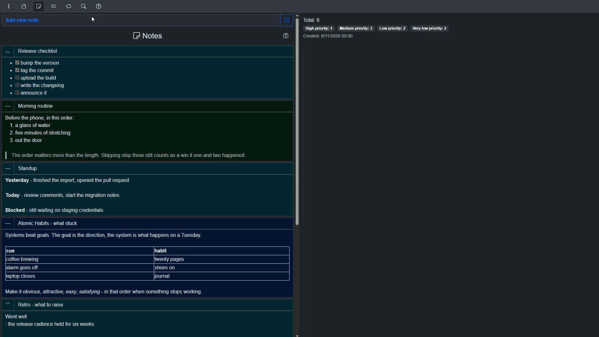

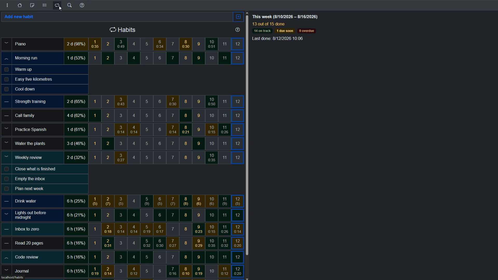

## Desktop screenshots:

[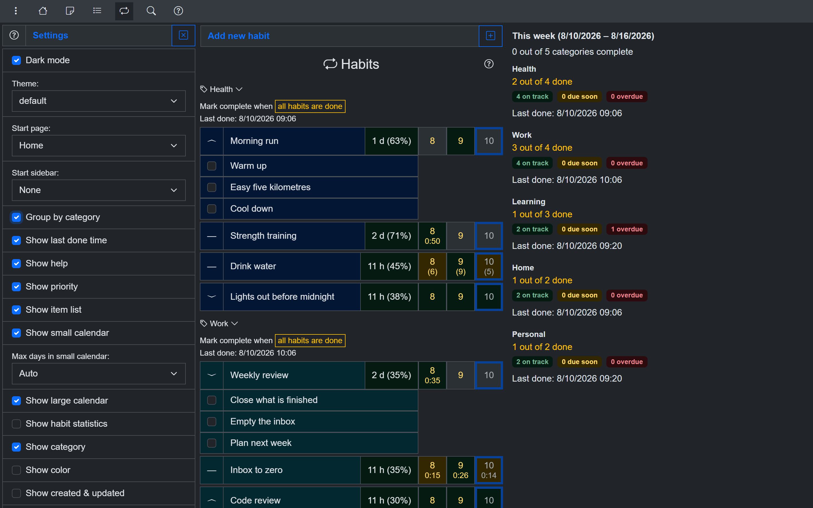](OpenHabitTracker.Web/images/desktop-settings.png)
[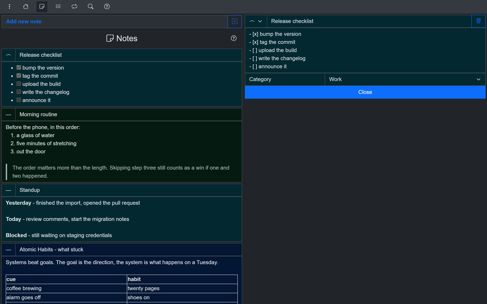](OpenHabitTracker.Web/images/desktop-note-detail.png)
[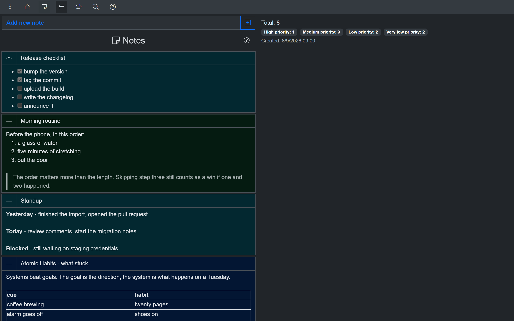](OpenHabitTracker.Web/images/desktop-notes.png)
[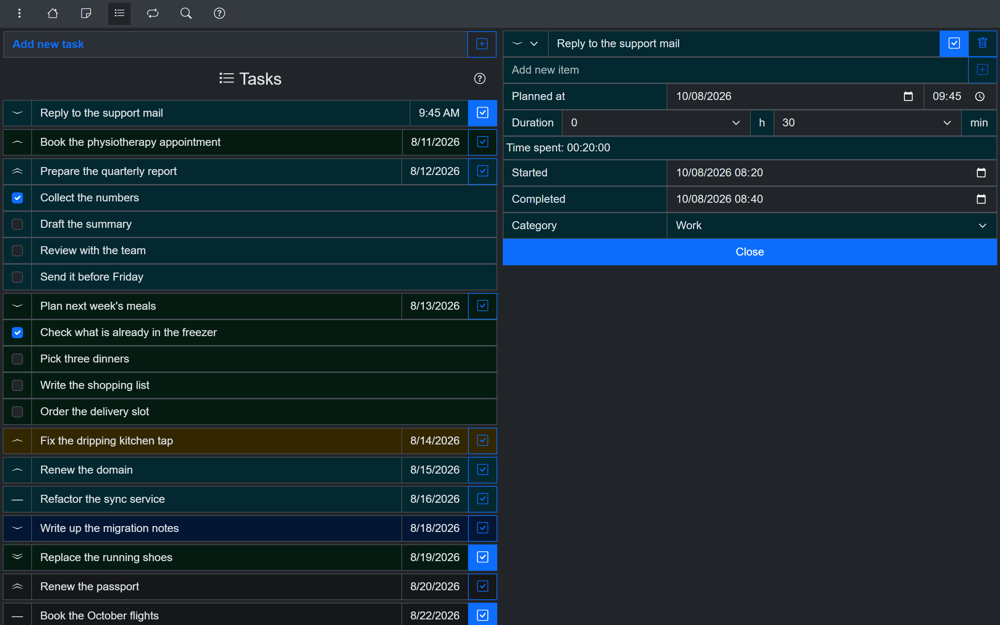](OpenHabitTracker.Web/images/desktop-task-detail.png)
[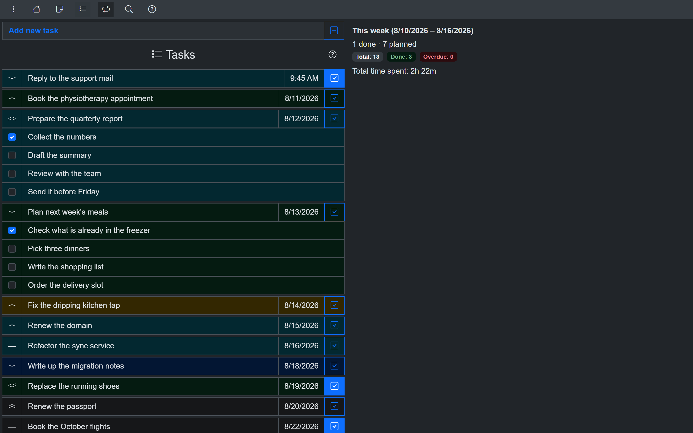](OpenHabitTracker.Web/images/desktop-tasks.png)
[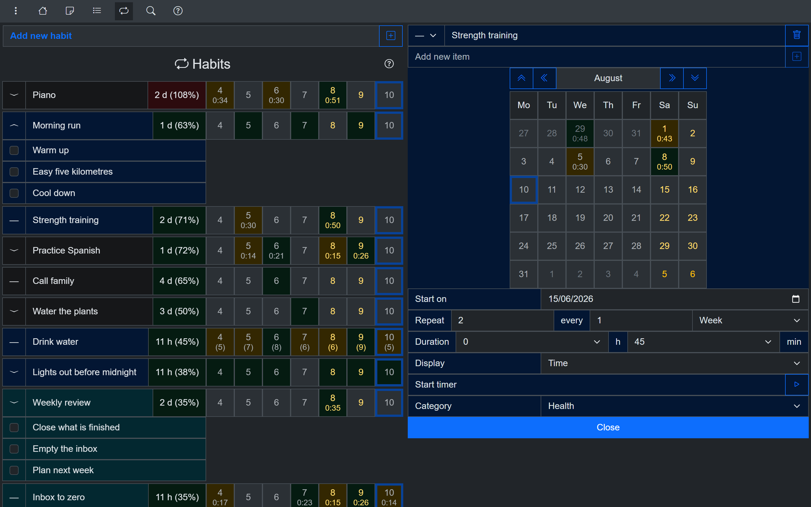](OpenHabitTracker.Web/images/desktop-habit-detail.png)
[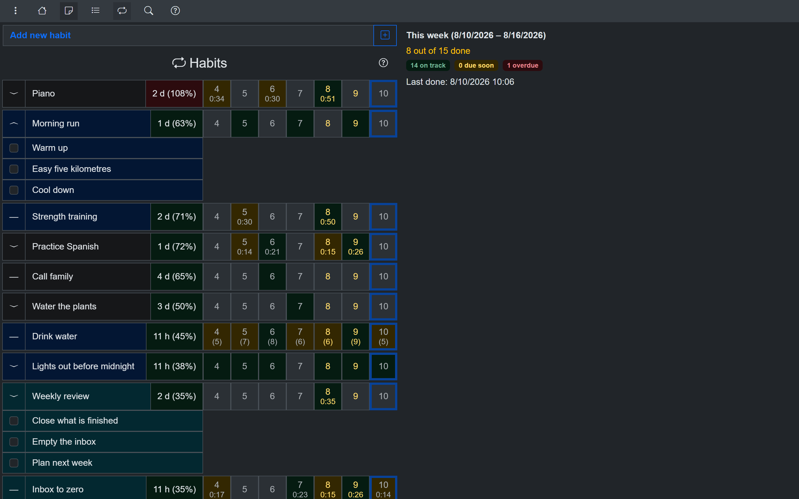](OpenHabitTracker.Web/images/desktop-habits.png)
[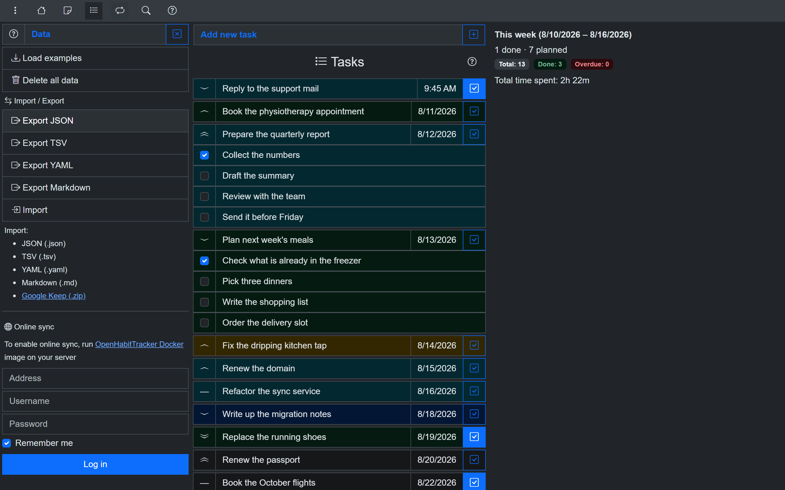](OpenHabitTracker.Web/images/desktop-sync.png)

## Phone screenshots:

[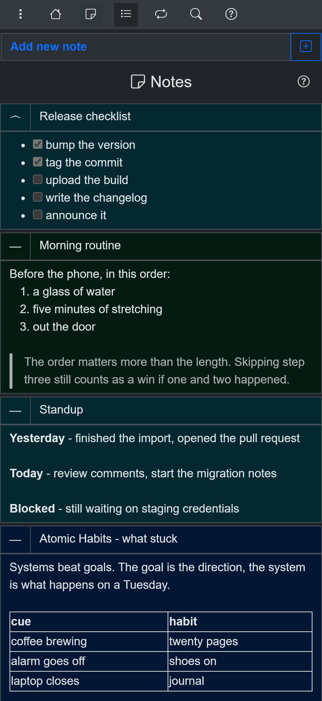](OpenHabitTracker.Web/images/phone-notes.png)
[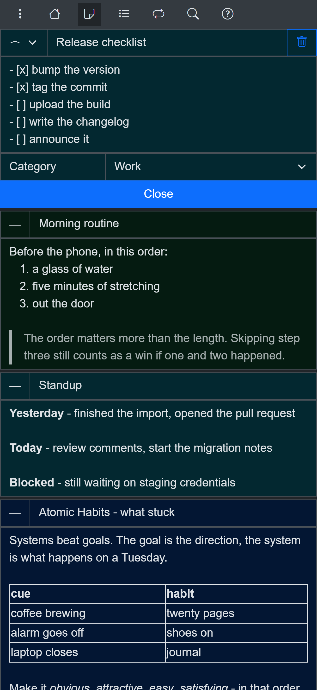](OpenHabitTracker.Web/images/phone-note-detail.png)
[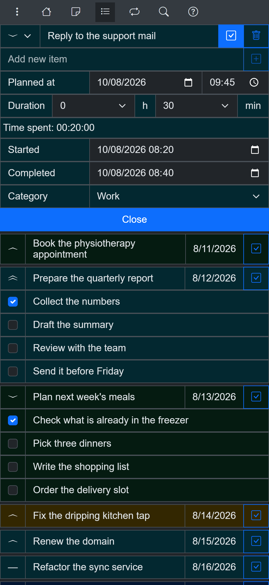](OpenHabitTracker.Web/images/phone-task-detail.png)
[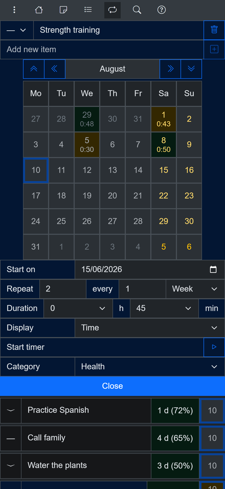](OpenHabitTracker.Web/images/phone-habit-detail.png)
[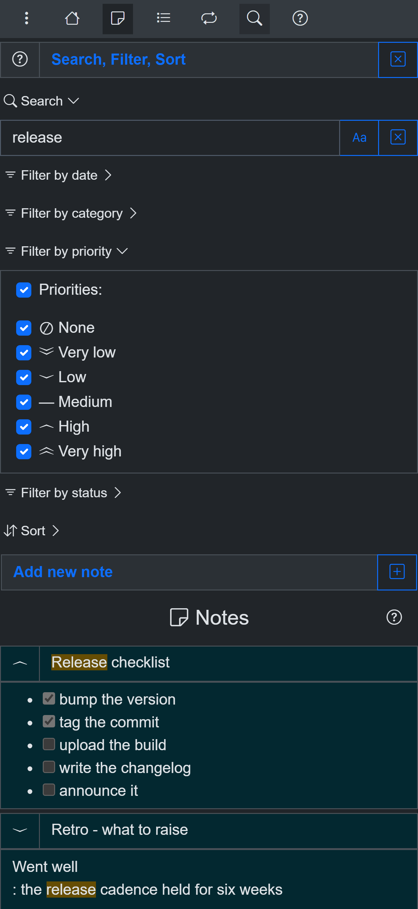](OpenHabitTracker.Web/images/phone-search.png)
[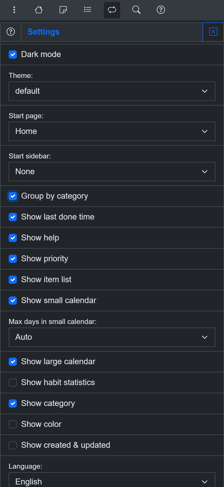](OpenHabitTracker.Web/images/phone-settings.png)
[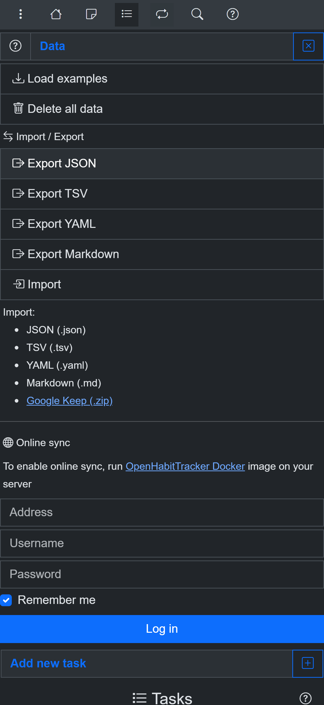](OpenHabitTracker.Web/images/phone-sync.png)
